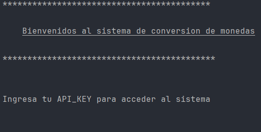
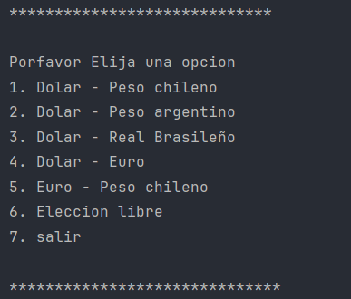

# 💰 Conversor de Monedas en Tiempo Real

¿Necesitas saber el valor exacto de una moneda en otro país? **Nuestro conversor de monedas en tiempo real** te proporciona datos actualizados, asegurando cálculos precisos. 🚀
Con este sistema podremos realizar conversiones rapidas con opciones predeterminadas o tambien la opcion de poder elegir entre dos monedas de cambio y el valor que desea convertir.

# Lista de Paises admitidos en el sistema

Tenemos un total de 161 monedas de cambio para la conversion :dollar:, entre las mas comunes tenemos:
- **AUD	/ Australian Dollar**
- **ARS	/ Argentine Peso**
- **BOB	/ Bolivian Boliviano**
- **BRL	/ Brazilian Real**
- **CLP	/ Chilean Peso**
- **EUR	/ Euro**

**Si desea ver la lista completa de monedas compatibles, puede ingresar al siguiente enlace:**
- https://www.exchangerate-api.com/docs/supported-currencies

## 🌟 Características Principales
- 🔄 **Tasas de cambio en tiempo real**
- 🌎 **Soporte para múltiples monedas**
- 📊 **Interfaz intuitiva y fácil de usar**
- 🛡️ **Datos seguros y confiables**
- ⚡ **Respuesta rápida y precisa**

## Instrucciones de uso
Para iniciar lo primero que debes hacer es generar tu API_KEY directo desde la pagina principal de la API, puedes hacerlo en el siguiente enlace:
- https://www.exchangerate-api.com

**Luego debemos descargar el repositorio y abrirlo con algun IDE de tu conveniencia (se sugiere el uso de Intellij Idea)**

Finalmente para poder hacer uso de la interfaz, haz click en run y aparecera la siguiente interfaz.

*En esta imagen podemos ver como se solicita la API_KEY :key:, luego de ingresarla podra hacer uso del menu principal*

**Aqui podemos observar como tenemos opciones predeterminadas y una opcion libre para elegir cualquier moneda de las 161 disponibles en la pagina.**

**Finalmente se elige el monto de conversion :dollar: y el sistema generara un mensaje con el valor exacto segun la utlima actualizacion del sistema.**
